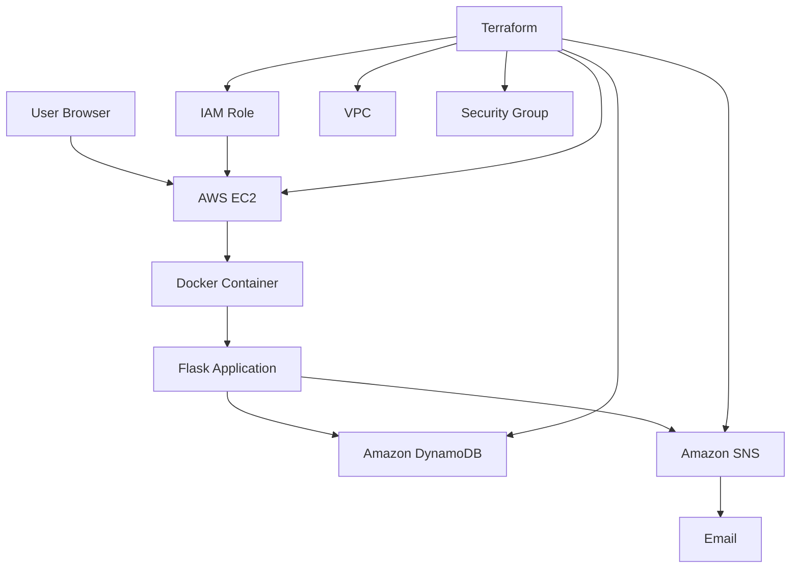

# CloudTodo (`to-do-jen`)

> **Production-grade Cloud & DevOps Project**: A containerized, modern Flask To-Do application powered by Amazon DynamoDB, Amazon SNS, Docker, and 100% automated AWS Infrastructure as Code (IaC) via Terraform with Jenkins CI/CD.

[](https://aws.amazon.com/)
[](https://www.terraform.io/)
[](https://www.docker.com/)
[](https://www.python.org/)
[](https://flask.palletsprojects.com/)
[](https://www.jenkins.io/)

> 🌐 **Live Demo Domain**: [http://cloudtodo.54.166.86.142.nip.io/](http://cloudtodo.54.166.86.142.nip.io/)  
> 📍 **Permanent Static IP**: [http://54.166.86.142/](http://54.166.86.142/) (Standard Port 80, no port number required)

---

## Table of Contents

- [CloudTodo (`to-do-jen`)](#cloudtodo-to-do-jen)
  - [Table of Contents](#table-of-contents)
  - [Project Overview](#project-overview)
  - [Problem Statement](#problem-statement)
  - [Solution](#solution)
  - [Features](#features)
  - [Architecture](#architecture)
  - [Technology Stack](#technology-stack)
  - [Project Structure](#project-structure)
  - [Prerequisites](#prerequisites)
  - [AWS CLI Setup](#aws-cli-setup)
  - [Terraform Setup](#terraform-setup)
  - [Configuration](#configuration)
  - [Terraform Variables](#terraform-variables)
  - [DynamoDB](#dynamodb)
  - [SNS Notifications](#sns-notifications)
  - [SNS Email Confirmation](#sns-email-confirmation)
  - [IAM Security](#iam-security)
  - [EC2 Deployment](#ec2-deployment)
  - [Docker](#docker)
  - [Local Development](#local-development)
  - [Automated Deployment](#automated-deployment)
  - [Windows Deployment](#windows-deployment)
  - [Linux/macOS Deployment](#linuxmacos-deployment)
  - [Testing](#testing)
  - [Jenkins CI/CD](#jenkins-cicd)
  - [Permanent Elastic IP & Cost Optimization](#permanent-elastic-ip--cost-optimization)
  - [Destroy Infrastructure](#destroy-infrastructure)
  - [Troubleshooting](#troubleshooting)
  - [Security](#security)
  - [Cost Considerations](#cost-considerations)
  - [Future Improvements](#future-improvements)
  - [Interview Explanation](#interview-explanation)

---

## Project Overview

**CloudTodo** is an end-to-end, enterprise-style Cloud and DevOps application designed to eliminate manual cloud setup ("ClickOps"). 

With a single execution of `./scripts/deploy.sh` or `.\scripts\deploy.ps1`, Terraform automatically provisions an entire isolated AWS network (VPC, Subnet, Route Tables, Internet Gateway, Security Group, IAM Roles, DynamoDB table, SNS topic, and EC2 instance) and spins up the containerized Flask application using Docker.

Anyone can clone this GitHub repository and run a single command to have a fully operational web application running live in the cloud.

---

## Problem Statement

Traditional cloud deployments frequently encounter critical pitfalls:
1. **Manual Configuration (ClickOps)**: Engineers manually configuring VPCs, EC2 instances, and security groups in the AWS Console, causing configuration drift, human error, and unreproducible environments.
2. **Credential Leaks**: Storing static AWS Access Keys and Secret Keys inside application code, Dockerfiles, or repositories.
3. **Fragile Dependencies**: Web applications crashing when downstream notification services (such as email delivery) experience network latency or outages.
4. **Environment Inconsistency**: Discrepancies between local developer machines and cloud hosts ("works on my machine, fails in production").

---

## Solution

CloudTodo resolves these industry challenges:
- **100% Declarative Infrastructure as Code**: The entire AWS stack is defined and versioned in Terraform.
- **Zero Static Credentials (IAM Instance Profiles)**: EC2 host securely acquires temporary AWS STS credentials through an IAM Role.
- **Decoupled Resilient Architecture**: Database persistence in DynamoDB is fully decoupled from SNS notifications. If SNS fails, task creation remains successful.
- **Strict Containerization**: The application runs identically on developer workstations via Docker Compose and on AWS EC2 using a non-root user.
- **Automated Turnkey Deployment**: Multi-platform scripts (`deploy.ps1` for Windows, `deploy.sh` for Linux/macOS) handle pre-flight checks, validation, and deployment.

---

## Features

### Application Features
1. **Add Task**: Real-time DynamoDB writes with automatic ISO 8601 timestamps and UUID keys.
2. **Display Tasks**: Chronological list with status badges, timestamps, and interactive row actions.
3. **Edit Task**: In-place description updates with live character countdown.
4. **Delete Task**: Safe task deletion with user confirmation prompts.
5. **Mark Completed**: Toggle pending tasks to completed with visual strikethrough.
6. **Mark Pending (Undo)**: Reopen completed tasks with a single click.
7. **Task Status Metrics**: Real-time cards displaying **Total**, **Completed**, and **Pending** counts.
8. **Interactive Filtering**: Filter by "All", "Pending", or "Completed" without page reloading.
9. **Creation & Update Timestamps**: Human-friendly formatted UTC timestamps with tooltips.
10. **Flash Notification System**: Auto-dismissing animated alert toasts for all CRUD events.
11. **Client & Server Validation**: Enforces whitespace trimming and character limits (1–250 chars).
12. **Custom Error Handling**: Dedicated custom `404 Not Found` and `500 Server Error` pages without leaking stack traces.
13. **Empty State UI**: Clean visual state when no tasks exist.
14. **Modern Design System**: Dark slate aesthetic (`#0a0e17`), glassmorphism cards, ambient glow gradients, and responsive mobile-first layout.

---

## Architecture



### Architectural Workflow:
1. **Terraform**: Creates the VPC, Subnet, Internet Gateway, Route Table, Security Group, DynamoDB Table, SNS Topic, and EC2 Instance.
2. **EC2 Bootstrapping**: EC2 initializes with an attached IAM Instance Profile. The `user_data` script installs Docker, fetches the application package, builds the Docker image, and starts the container.
3. **Application Serving**: Gunicorn serves Flask inside the container, mapped to host port `5000`.
4. **Data Layer**: Flask writes tasks to Amazon DynamoDB using Boto3 and IAM role credentials.
5. **Notification Layer**: Flask publishes event alerts to Amazon SNS, which sends emails to subscribed users.

---

## Technology Stack

| Layer | Technology | Version | Purpose |
|---|---|---|---|
| **Backend** | Python / Flask / Gunicorn | 3.11+ / 3.0 / 22.0 | Application factory, blueprints, WSGI server |
| **AWS SDK** | Boto3 / Botocore | 1.34+ | IAM Role integration, DynamoDB & SNS clients |
| **Frontend** | HTML5 / CSS3 / Vanilla JS | Modern | Glassmorphism UI, Google Fonts (*Plus Jakarta Sans*, *Inter*) |
| **Database** | Amazon DynamoDB | Serverless | NoSQL, `PAY_PER_REQUEST` on-demand billing, partition key `task_id` |
| **Notifications** | Amazon SNS | Serverless | Event publishing and email subscriber distribution |
| **Compute** | Amazon EC2 | Amazon Linux 2023 | `t3.micro` (AWS Free Tier eligible) |
| **Networking** | Amazon VPC | AWS Native | Dedicated VPC (`10.0.0.0/16`), public subnet, IGW, route table |
| **Security** | AWS IAM & Security Groups | AWS Native | Least privilege IAM role, instance profile, port restrictions |
| **IaC** | HashiCorp Terraform | 1.5+ | Automated infrastructure provisioning |
| **Containers** | Docker & Docker Compose | 24+ | Production Dockerfile (non-root `appuser`) |
| **CI/CD** | Jenkins | 2.x | Automated linting, pytest, container validation, deployment |
| **Testing** | Pytest & Pytest-Mock | 8.2+ | Unit & integration tests (100% offline via mocks) |

---

## Project Structure

```text
to-do/
├── .env.example                  # Template for local environment variables
├── .gitignore                    # Git ignore rules for Python, Terraform, and keys
├── Dockerfile                    # Production multi-stage Docker build
├── docker-compose.yml            # Docker Compose configuration for local testing
├── Jenkinsfile                   # Declarative Jenkins CI/CD pipeline (8 stages)
├── README.md                     # Comprehensive project documentation
├── requirements.txt              # Production Python dependencies
├── requirements-dev.txt          # Testing & development dependencies
├── run.py                        # WSGI entry point
├── pytest.ini                    # Pytest test discovery & path settings
├── app/
│   ├── __init__.py               # Flask application factory, logging & error handlers
│   ├── config.py                 # Configuration class reading environment variables
│   ├── dynamodb.py               # DynamoDB CRUD service with Boto3
│   ├── routes.py                 # Application routes (CRUD, stats, redirects)
│   ├── sns_service.py            # SNS publish service with event templates
│   ├── utils.py                  # Input validation & timestamp formatting
│   ├── static/
│   │   ├── css/
│   │   │   └── style.css         # Modern dark-mode glassmorphism design system
│   │   └── js/
│   │       └── app.js            # Dynamic filtering, character counters & UI logic
│   └── templates/
│       ├── base.html             # Base layout with navbar, alerts & badges
│       ├── index.html            # Task dashboard with metrics and task list
│       ├── edit.html             # Task edit form and metadata viewer
│       ├── 404.html              # Custom 404 Not Found error page
│       └── 500.html              # Custom 500 Server Error page
├── scripts/
│   ├── deploy.sh                 # Single-click deployment script (Linux / macOS)
│   ├── deploy.ps1                # Single-click deployment script (Windows PowerShell)
│   ├── destroy.sh                # Teardown script (Linux / macOS)
│   └── destroy.ps1               # Teardown script (Windows PowerShell)
├── terraform/
│   ├── provider.tf               # Terraform AWS provider configuration
│   ├── variables.tf              # Input variable definitions
│   ├── locals.tf                 # Resource naming prefixes and common tags
│   ├── networking.tf             # VPC, Subnet, IGW, and Route Table resources
│   ├── security.tf               # Security Group ingress and egress rules
│   ├── iam.tf                    # EC2 IAM Role, Policy and Instance Profile
│   ├── dynamodb.tf               # DynamoDB table definition
│   ├── sns.tf                    # SNS Topic and email subscription
│   ├── s3.tf                     # S3 bucket for storing app deployment package
│   ├── ec2.tf                    # EC2 instance and AMI resolution
│   ├── outputs.tf                # Outputs (App URL, IP, Table Name, SNS ARN)
│   ├── user_data.sh              # EC2 cloud-init bootstrap script
│   └── terraform.tfvars.example  # Example variable values
└── tests/
    ├── conftest.py               # Pytest fixtures and test environment setup
    ├── test_dynamodb.py          # Unit tests for DynamoDB operations
    ├── test_routes.py            # Integration tests for Flask routes
    └── test_sns.py               # Unit tests for SNS event notifications
```

---

## Prerequisites

Ensure you have the following installed on your local computer:
1. **AWS CLI** (v2.x or later): [Install Guide](https://docs.aws.amazon.com/cli/latest/userguide/getting-started-install.html)
2. **Terraform** (v1.5.0 or later): [Install Guide](https://developer.hashicorp.com/terraform/install)
3. **Git**: [Install Guide](https://git-scm.com/downloads)
4. **Python 3.11+** (for running local tests): [Python Downloads](https://www.python.org/downloads/)
5. **Docker** (optional, for running local containers): [Docker Desktop](https://www.docker.com/products/docker-desktop/)

---

## AWS CLI Setup

Configure your AWS credentials:

```bash
aws configure
```

Enter your details:
- **AWS Access Key ID**: `AKIA...`
- **AWS Secret Access Key**: `...`
- **Default region name**: `us-east-1`
- **Default output format**: `json`

Verify authentication:
```bash
aws sts get-caller-identity
```

---

## Terraform Setup

Verify Terraform is installed:
```bash
terraform -version
```

Terraform automatically uses the AWS credentials configured in the AWS CLI.

---

## Configuration

Copy the example configuration to create your active `terraform.tfvars`:

```powershell
Copy-Item terraform\terraform.tfvars.example terraform\terraform.tfvars
```

---

## Terraform Variables

All configuration parameters in `terraform/terraform.tfvars`:

| Variable | Description | Default | Free Tier Eligible |
|---|---|---|---|
| `aws_region` | AWS Region for provisioning | `us-east-1` | Yes |
| `project_name` | Project identifier for resources | `cloudtodo` | Yes |
| `environment` | Environment label (`dev`, `prod`) | `dev` | Yes |
| `instance_type` | EC2 instance size | `t3.micro` | Yes |
| `ami_id` | Custom AMI ID (leave empty for auto Amazon Linux 2023) | `""` | Yes |
| `key_name` | EC2 Key Pair for SSH access | `""` | Optional |
| `vpc_cidr` | Virtual Private Cloud CIDR | `10.0.0.0/16` | Yes |
| `subnet_cidr` | Public Subnet CIDR | `10.0.1.0/24` | Yes |
| `availability_zone` | Target AWS Availability Zone | `us-east-1a` | Yes |
| `allowed_ssh_cidr` | IP allowed to SSH on port 22 | `0.0.0.0/0` | Configure your IP |
| `app_repository_url` | Git repository URL for bootstrapping | `https://github.com/Sanskar4009/to-do-jen.git` | Yes |
| `dynamodb_table_name`| Name of the DynamoDB tasks table | `cloudtodo-tasks` | Yes |
| `sns_topic_name` | Name of the Amazon SNS topic | `cloudtodo-notifications` | Yes |
| `notification_email` | Email to receive task alerts | `your-email@example.com` | Yes |
| `app_port` | Application port on EC2 | `5000` | Yes |

---

## DynamoDB

CloudTodo uses **Amazon DynamoDB**, an AWS-managed serverless NoSQL database.

### Table Characteristics:
- **Table Name**: `cloudtodo-tasks`
- **Billing Mode**: `PAY_PER_REQUEST` (On-Demand billing; zero cost when idle)
- **Partition Key**: `task_id` (String, UUID v4)
- **Attributes**:
  - `task_id` (String): Unique identifier
  - `task_name` (String): Task description
  - `completed` (Boolean): Status flag
  - `created_at` (String): ISO 8601 UTC timestamp
  - `updated_at` (String): ISO 8601 UTC timestamp

### Data Model Example:
```json
{
  "task_id": "8f8b8941-4775-4ee4-9040-cfc9413241b7",
  "task_name": "Learn Terraform on AWS",
  "completed": false,
  "created_at": "2026-10-02T12:30:00.000000+00:00",
  "updated_at": "2026-10-02T12:30:00.000000+00:00"
}
```

---

## SNS Notifications

Amazon Simple Notification Service (Amazon SNS) publishes real-time alerts whenever tasks are modified.

### Supported Events:
1. **Task Created**:
   - **Subject**: `CloudTodo - New Task Created`
   - **Message**: Task title, Status: Pending, Created timestamp.
2. **Task Completed**:
   - **Subject**: `CloudTodo - Task Completed`
   - **Message**: Task title, Status: Completed.
3. **Task Reopened (Undo)**:
   - **Subject**: `CloudTodo - Task Reopened`
   - **Message**: Task title, Status: Pending.
4. **Task Updated**:
   - **Subject**: `CloudTodo - Task Updated`
   - **Message**: Task title, updated status.
5. **Task Deleted**:
   - **Subject**: `CloudTodo - Task Deleted`
   - **Message**: Task title.

### Resilient Error Handling:
If a DynamoDB operation succeeds but Amazon SNS fails (e.g., unverified email or network issue), **the task operation remains successful**. The SNS error is logged, preventing any interruption to the user experience.

---

## SNS Email Confirmation

> [!IMPORTANT]
> **AWS SNS email subscriptions require one-time confirmation!**

When you configure `notification_email` in `terraform.tfvars`:
1. Terraform creates the `aws_sns_topic_subscription`.
2. AWS sends a confirmation email with the subject:
   `AWS Notification - Subscription Confirmation`
3. Open your inbox and click **Confirm subscription**.
4. Until confirmed, AWS marks the subscription as `PendingConfirmation`, and no task notifications will be delivered.

---

## IAM Security

CloudTodo enforces the AWS **Principle of Least Privilege**:

1. **No Hardcoded Keys**: The EC2 instance and Docker container do not store any AWS Access Keys or Secret Keys.
2. **IAM Instance Profile**: EC2 assumes the role `cloudtodo-dev-ec2-role` via an instance profile.
3. **Scoped Policies**:
   - **DynamoDB**: Restricted strictly to `aws_dynamodb_table.tasks.arn` and sub-resources (`/*`).
   - **SNS**: Restricted strictly to `aws_sns_topic.notifications.arn`.
   - **S3**: Restricted strictly to reading the application archive from `aws_s3_bucket.app_artifacts.arn`.
   - **No Wildcards**: `Resource = "*"` is strictly avoided for data operations.

---

## EC2 Deployment

The EC2 instance runs Amazon Linux 2023:
1. Placed in the public subnet with an automatically assigned public IPv4 address.
2. Security Group permits inbound traffic on:
   - Port `5000` (Flask web application)
   - Port `80` (HTTP)
   - Port `22` (SSH, restricted to your IP)
3. Cloud-init `user_data.sh`:
   - Updates operating system packages.
   - Installs and enables the Docker service.
   - Pulls the application bundle.
   - Builds the production Docker image.
   - Runs the container with `--restart unless-stopped` mapping port `5000:5000`.

---

## Docker

### Production Dockerfile:
- **Base**: `python:3.11-slim` (minimal attack surface, ~150MB).
- **User**: Unprivileged user (`appuser`, UID 1000).
- **WSGI Server**: Gunicorn with 2 workers and 4 threads.
- **Healthcheck**: Built-in `curl -f http://localhost:5000/ || exit 1`.

### Build & Run Locally:
```bash
docker build -t cloudtodo:latest .
docker run -d -p 5000:5000 cloudtodo:latest
```

---

## Local Development

Run CloudTodo locally with or without Docker:

### Virtual Environment:
```bash
# 1. Create and activate virtual environment
python -m venv .venv
.\.venv\Scripts\Activate.ps1   # Windows
source .venv/bin/activate       # Linux/macOS

# 2. Install dependencies
pip install -r requirements-dev.txt

# 3. Create .env file
cp .env.example .env

# 4. Start local Flask server
python run.py
```
Open **[http://localhost:5000](http://localhost:5000)** in your browser.

---

## Automated Deployment

Deploy the entire infrastructure in a single command.

### Windows Deployment:
```powershell
.\scripts\deploy.ps1
```

### Linux / macOS Deployment:
```bash
chmod +x scripts/*.sh
./scripts/deploy.sh
```

### The deployment script will:
1. Verify `terraform` and `aws` CLI installations.
2. Authenticate with AWS via STS.
3. Validate configuration variables.
4. Execute `terraform init`, `terraform fmt`, and `terraform validate`.
5. Generate an execution plan (`terraform plan -out=tfplan`).
6. Prompt you for confirmation (`yes`).
7. Apply the plan and output the live **Application URL**, **EC2 Public IP**, and resource identifiers.

---

## Testing

The project includes unit and integration tests using `pytest` that run **100% offline** using mocks (no real AWS charges or credentials needed):

```bash
.\.venv\Scripts\pytest -v
```

### Test Coverage (28/28 Passing):
- **Routes (`tests/test_routes.py`)**: Tests `GET /`, `POST /add`, `POST /complete`, `GET /edit`, `POST /edit`, `POST /delete`, 404 handler, and graceful DynamoDB error recovery.
- **DynamoDB Service (`tests/test_dynamodb.py`)**: Tests task CRUD, sorting, and ClientError scenarios.
- **SNS Service (`tests/test_sns.py`)**: Tests notification publishing, event message formatting, and resilient failure handling.

---

## Jenkins CI/CD

The repository includes a production-ready [Jenkinsfile](file:///e:/btech/devops%20engi%20journey/to-do/Jenkinsfile) containing 8 declarative stages:

1. **Checkout**: Pulls the latest commit from Git.
2. **Setup Python**: Creates an isolated virtual environment and installs dependencies.
3. **Run Tests**: Executes `pytest` and exports JUnit XML test reports.
4. **Terraform Format**: Enforces Terraform formatting (`terraform fmt -check`).
5. **Terraform Validate**: Validates Terraform configuration syntax.
6. **Docker Build**: Builds the production Docker image.
7. **Docker Smoke Test**: Boots a test container on port 5001 and executes an HTTP healthcheck.
8. **Deploy to AWS**: Applies Terraform changes using AWS credentials stored in Jenkins Credentials Manager (`aws-credentials-id`).

---

## Permanent Elastic IP & Cost Optimization

CloudTodo allocates a dedicated AWS **Elastic IP (EIP)** associated with the EC2 instance. This guarantees that **the application's public IP address never changes**, so demo links on LinkedIn, resumes, and project portfolios stay permanently valid.

### Pause Compute Costs ($0 EC2 Billing):
When you are not demoing or actively testing the application, you can stop the EC2 instance to pause compute billing ($0.00/hour for compute):

- **Windows**:
  ```powershell
  .\scripts\stop-ec2.ps1
  ```
- **Linux / macOS**:
  ```bash
  ./scripts/stop-ec2.sh
  ```

### Resume Instantly with the Same URL:
Whenever you want to show the live project to an interviewer or recruiter, resume the instance:

- **Windows**:
  ```powershell
  .\scripts\start-ec2.ps1
  ```
- **Linux / macOS**:
  ```bash
  ./scripts/start-ec2.sh
  ```

Because the Docker container is configured with `--restart unless-stopped`, the Flask web application boots automatically within 30–60 seconds, and the live application is reachable at the exact same public URL.

---

## Destroy Infrastructure

When you are done testing, tear down all AWS resources to prevent ongoing charges:

### Windows:
```powershell
.\scripts\destroy.ps1
```

### Linux / macOS:
```bash
./scripts/destroy.sh
```

Type `destroy` to confirm permanent removal of the EC2 instance, DynamoDB table, SNS topic, S3 bucket, and VPC.

---

## Troubleshooting

### 1. Website not loading immediately after deployment
- **Cause**: EC2 `user_data` takes approximately 60–90 seconds to install Docker and build the container image.
- **Fix**: Wait 1–2 minutes and refresh the browser.

### 2. Not receiving SNS notification emails
- **Cause**: The confirmation email has not been verified.
- **Fix**: Check your email inbox (and spam folder) for an email from `no-reply@sns.amazonaws.com` and click **Confirm subscription**.

### 3. Resources not visible in AWS Console
- **Cause**: Wrong region selected in the top-right corner of the AWS Console.
- **Fix**: Switch the region dropdown to **US East (N. Virginia) `us-east-1`**.

---

## Security

1. **Zero Credential Exposure**: No AWS Access Keys stored in code, Dockerfiles, or Git commits.
2. **Temporary STS Tokens**: EC2 acquires temporary credentials dynamically through the IAM Instance Profile.
3. **Network Isolation**: Dedicated VPC with strict ingress security group rules.
4. **Non-Root Execution**: Container runs as an unprivileged user (`appuser`).
5. **Masked Secrets**: Flask `SECRET_KEY` is loaded from environment variables and never logged.

---

## Cost Considerations

Deploying CloudTodo in standard AWS accounts is eligible for the **AWS Free Tier**:
- **EC2**: `t3.micro` is covered under the AWS Free Tier (750 hours/month).
- **DynamoDB**: 25 GB of storage and 2.5 million read/write units free under AWS Always Free Tier.
- **Amazon SNS**: 1 million free publishes and 1,000 free email notifications per month.
- **VPC & Internet Gateway**: Free.

*Remember to run `destroy.ps1` or `destroy.sh` when you are done to avoid any future charges.*

---

## Future Improvements

1. **Remote State Backend**: Migrate Terraform local state to an S3 bucket with DynamoDB state locking.
2. **Application Load Balancer (ALB) & HTTPS**: Add AWS ACM SSL certificates and an ALB for TLS encryption on port 443.
3. **Auto Scaling Group (ASG)**: Deploy EC2 instances across multiple Availability Zones.
4. **AWS ECS Fargate**: Migrate from EC2 Docker hosting to serverless containers.

---

## Interview Explanation

When presenting this project in a DevOps / Cloud Architect technical interview, you can summarize your architecture and design decisions as follows:

> *"In this project, I built a production-style, cloud-native To-Do application engineered around the principle of zero-touch automated infrastructure.*
>
> *I designed a modular Flask backend that persists state to Amazon DynamoDB and publishes decoupled events to Amazon SNS. To ensure zero-credential exposure, I used AWS IAM Instance Profiles so the EC2 host securely acquires temporary AWS STS tokens without storing static keys.*
>
> *For infrastructure orchestration, I authored pure Terraform modules provisioning an isolated VPC, public subnet, route tables, security groups, DynamoDB with On-Demand billing, and an SNS notification pipeline.*
>
> *I containerized the application with Docker using a non-root user and Gunicorn WSGI, automated bootstrapping via EC2 cloud-init user data, and implemented a Jenkins CI/CD pipeline that enforces automated unit testing with pytest, Terraform linting, and Docker container smoke tests.*
> 
> *The entire deployment is wrapped in cross-platform deployment scripts, allowing anyone to clone the repo and spin up the complete cloud infrastructure in a single command."*
