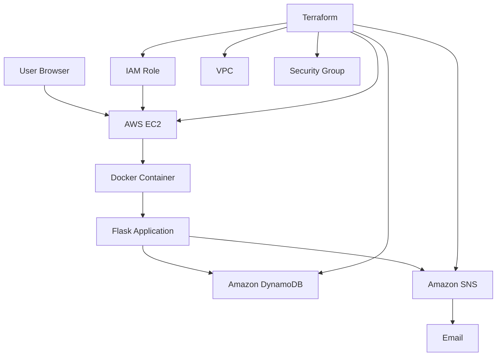

# CloudTodo

> **Production-grade Cloud & DevOps Project**: A modern, containerized Flask To-Do application powered by AWS DynamoDB, Amazon SNS, Docker, and fully automated via Terraform Infrastructure as Code (IaC) with Jenkins CI/CD.

---

## Table of Contents

- [CloudTodo](#cloudtodo)
  - [Table of Contents](#table-of-contents)
  - [Project Overview](#project-overview)
  - [Problem Statement](#problem-statement)
  - [Solution](#solution)
  - [Features](#features)
  - [Architecture](#architecture)
  - [Technology Stack](#technology-stack)
  - [Project Structure](#project-structure)
  - [Prerequisites](#prerequisites)
  - [AWS CLI Setup](#aws-cli-setup)
  - [Terraform Setup](#terraform-setup)
  - [Configuration](#configuration)
  - [Terraform Variables](#terraform-variables)
  - [DynamoDB](#dynamodb)
  - [SNS Notifications](#sns-notifications)
  - [SNS Email Confirmation](#sns-email-confirmation)
  - [IAM Security](#iam-security)
  - [EC2 Deployment](#ec2-deployment)
  - [Docker](#docker)
  - [Local Development](#local-development)
  - [Automated Deployment](#automated-deployment)
  - [Windows Deployment](#windows-deployment)
  - [Linux/macOS Deployment](#linuxmacos-deployment)
  - [Testing](#testing)
  - [Jenkins CI/CD](#jenkins-cicd)
  - [Destroy Infrastructure](#destroy-infrastructure)
  - [Troubleshooting](#troubleshooting)
  - [Security](#security)
  - [Cost Considerations](#cost-considerations)
  - [Future Improvements](#future-improvements)
  - [Interview Explanation](#interview-explanation)

---

## Project Overview

**CloudTodo** is an end-to-end, production-style Cloud and DevOps implementation. It deploys a Python Flask task management application on AWS using modern Infrastructure as Code (IaC) principles. 

The core philosophy of this project is **Zero Manual Cloud Configuration**:
Anyone can clone this GitHub repository, execute a single deployment script (`deploy.sh` or `deploy.ps1`), and watch Terraform automatically provision an entire enterprise-style AWS environment (VPC, Subnet, Route Tables, Internet Gateway, Security Groups, IAM Roles, DynamoDB, SNS Topic, and EC2) and launch the containerized application without clicking a single button in the AWS Management Console.

---

## Problem Statement

Traditional application deployments to cloud environments often suffer from:
1. **Manual ClickOps**: Engineers manually creating VPCs, EC2 instances, security groups, and databases in cloud consoles, leading to human error, configuration drift, and unreproducible setups.
2. **Hardcoded Secrets & Overprivileged Credentials**: Developers hardcoding AWS Access Keys and Secret Keys in application code or configuration files.
3. **Coupled Infrastructure**: Cloud resource names and parameters hardcoded across scripts and source code.
4. **Poor Failure Resilience**: Applications crashing when downstream services (e.g., email notification systems) encounter network delays or outages.
5. **Slow Onboarding**: Lack of reproducible local development environments and multi-platform automation scripts.

---

## Solution

CloudTodo resolves these pain points through:
- **Declarative Infrastructure as Code**: 100% of AWS infrastructure is provisioned through modular Terraform configurations.
- **IAM Instance Profiles & Least Privilege**: Zero static AWS credentials in code. EC2 instances securely assume an IAM role with scoped policies.
- **Resilient Microservice Design**: Task persistence in DynamoDB is decoupled from notification delivery in Amazon SNS. If SNS experiences an outage, task creation still succeeds.
- **Containerization**: The application runs identically on local workstations via Docker Compose and in production via Docker on Amazon Linux 2023.
- **Cross-Platform Single-Command Deployment**: Turnkey deployment scripts for Linux/macOS (`deploy.sh`) and Windows PowerShell (`deploy.ps1`).

---

## Features

### Core Application Capabilities
1. **Add Task**: Create new tasks with instant DynamoDB persistence and SNS event triggering.
2. **Display Tasks**: View tasks sorted chronologically (newest first) with status and timestamp metadata.
3. **Edit Task**: In-place task description editing with metadata inspection.
4. **Delete Task**: Safe task removal with confirmation dialog and SNS event publishing.
5. **Mark Completed**: Toggle pending tasks to completed with visual strikethrough and badge changes.
6. **Mark Pending (Undo)**: Reopen completed tasks back to pending status.
7. **Task Status Metrics**: Real-time counter cards showing **Total Tasks**, **Completed**, and **Pending**.
8. **Interactive Filter Tabs**: Filter task views by "All", "Pending", or "Completed" without page reloading.
9. **Creation & Update Timestamps**: Formatted ISO 8601 UTC timestamps with relative tooltips.
10. **Flash Notification System**: Dynamic, dismissible alert toasts for create, edit, toggle, and delete events.
11. **Client & Server-Side Validation**: Whitespace trimming, required field enforcement, and length constraints (1–250 chars).
12. **Character Counter**: Dynamic countdown indicator preventing form overflow.
13. **Resilient Error Handling**: Dedicated custom `404 Not Found` and `500 Internal Server Error` pages without leaking internal stack traces.
14. **Empty State UI**: Clean, friendly visual illustration when no tasks are present.
15. **Modern Tech Aesthetic**: Sleek dark mode, ambient mesh gradients, glassmorphism cards, and responsive mobile-first layout.

---

## Architecture



### Architectural Flow:
1. **Terraform Execution**: Terraform communicates with AWS APIs to provision the VPC, Subnet, Internet Gateway, Route Tables, Security Group, DynamoDB Table, SNS Topic, and IAM Role.
2. **EC2 Bootstrapping**: EC2 initializes with an attached IAM Instance Profile. The `user_data` script installs Docker and Git, clones the repository, and boots the containerized Flask app.
3. **User Access**: Users access the web interface via `http://<EC2-Public-IP>:5000`.
4. **Data Persistence**: Flask interacts with Amazon DynamoDB via Boto3, using temporary STS credentials obtained automatically from the EC2 Instance Profile.
5. **Event Notifications**: Upon successful DynamoDB writes, Flask asynchronously publishes formatted notification messages to Amazon SNS, which distributes emails to subscribed users.

---

## Technology Stack

| Layer | Technology | Details |
|---|---|---|
| **Backend** | Python 3.11+, Flask 3.0, Gunicorn 22.0 | Modular application factory, blueprints, WSGI |
| **AWS SDK** | Boto3 1.34+, Botocore | IAM Role integration, ClientError exception handling |
| **Frontend** | HTML5, CSS3, Vanilla JavaScript | Responsive glassmorphism UI, Google Fonts (Plus Jakarta Sans & Inter) |
| **Database** | Amazon DynamoDB | NoSQL, `PAY_PER_REQUEST` on-demand billing, partition key `task_id` |
| **Notifications** | Amazon SNS | Publish/Subscribe messaging with email topic subscriptions |
| **Cloud Compute** | AWS EC2 (Amazon Linux 2023) | `t2.micro` (AWS Free Tier eligible) |
| **Networking** | AWS VPC, Public Subnet, IGW, Route Tables | Dedicated isolated network CIDR `10.0.0.0/16` |
| **Security** | AWS IAM, Security Groups | Least-privilege role, restricted ingress on port 22/5000/80 |
| **Infrastructure as Code** | Terraform (v1.5+) | Modular resource blocks, plan/apply lifecycle |
| **Containers** | Docker, Docker Compose | Python 3.11-slim base, non-root user `appuser` |
| **CI/CD** | Jenkins | Declarative pipeline (Lint, Test, Validate, Build, Deploy) |
| **Testing** | Pytest 8.2+, Pytest-Mock | Unit tests, route integration tests, mocked AWS services |

---

## Project Structure

```text
cloudtodo/
├── .env.example                  # Template for local environment variables
├── .gitignore                    # Git ignore rules for Python, Terraform, and OS
├── Dockerfile                    # Production multi-stage Docker build
├── docker-compose.yml            # Docker Compose configuration for local testing
├── Jenkinsfile                   # Declarative Jenkins CI/CD pipeline
├── README.md                     # Comprehensive documentation and architecture guide
├── requirements.txt              # Production Python dependencies
├── requirements-dev.txt          # Development and testing dependencies
├── run.py                        # WSGI entry point
├── app/
│   ├── __init__.py               # Flask application factory, logging & error handlers
│   ├── config.py                 # Configuration class reading environment variables
│   ├── dynamodb.py               # DynamoDB CRUD service with Boto3
│   ├── routes.py                 # Application routes (CRUD, stats, redirects)
│   ├── sns_service.py            # SNS publish service with event templates
│   ├── utils.py                  # Input validation & timestamp formatting
│   ├── static/
│   │   ├── css/
│   │   │   └── style.css         # Modern dark-mode glassmorphism design system
│   │   └── js/
│   │       └── app.js            # Dynamic filtering, character counters & UI logic
│   └── templates/
│       ├── base.html             # Base layout with navbar, alerts & badges
│       ├── index.html            # Task dashboard with metrics and task list
│       ├── edit.html             # Task edit form and metadata viewer
│       ├── 404.html              # Custom 404 Not Found error page
│       └── 500.html              # Custom 500 Server Error page
├── scripts/
│   ├── deploy.sh                 # Single-click deployment script (Linux / macOS)
│   ├── deploy.ps1                # Single-click deployment script (Windows PowerShell)
│   ├── destroy.sh                # Teardown script (Linux / macOS)
│   └── destroy.ps1               # Teardown script (Windows PowerShell)
├── terraform/
│   ├── provider.tf               # Terraform AWS provider configuration
│   ├── variables.tf              # Input variable definitions
│   ├── locals.tf                 # Resource naming prefixes and common tags
│   ├── networking.tf             # VPC, Subnet, IGW, and Route Table resources
│   ├── security.tf               # Security Group ingress and egress rules
│   ├── iam.tf                    # EC2 IAM Role, Policy and Instance Profile
│   ├── dynamodb.tf               # DynamoDB table definition
│   ├── sns.tf                    # SNS Topic and email subscription
│   ├── ec2.tf                    # EC2 instance and AMI resolution
│   ├── outputs.tf                # Outputs (App URL, IP, Table Name, SNS ARN)
│   ├── user_data.sh              # EC2 cloud-init bootstrap script
│   └── terraform.tfvars.example  # Example variable values
└── tests/
    ├── conftest.py               # Pytest fixtures and test environment setup
    ├── test_dynamodb.py          # Unit tests for DynamoDB operations
    ├── test_routes.py            # Integration tests for Flask routes
    └── test_sns.py               # Unit tests for SNS event notifications
```

---

## Prerequisites

Before deploying CloudTodo, ensure your machine has the following tools installed:

1. **AWS CLI** (v2.x or later): [Install Guide](https://docs.aws.amazon.com/cli/latest/userguide/getting-started-install.html)
2. **Terraform** (v1.5.0 or later): [Install Guide](https://developer.hashicorp.com/terraform/install)
3. **Git**: [Install Guide](https://git-scm.com/downloads)
4. **Python 3.11+** (for local development and testing): [Python Downloads](https://www.python.org/downloads/)
5. **Docker** (optional, for local container testing): [Install Docker Desktop](https://www.docker.com/products/docker-desktop/)

---

## AWS CLI Setup

Configure your AWS credentials on your local machine:

```bash
aws configure
```

You will be prompted for:
- **AWS Access Key ID**: Your AWS Access Key
- **AWS Secret Access Key**: Your AWS Secret Access Key
- **Default region name**: `us-east-1` (or your preferred region)
- **Default output format**: `json`

Verify authentication:
```bash
aws sts get-caller-identity
```

Output should show your AWS Account ID and IAM User ARN.

---

## Terraform Setup

Verify Terraform is accessible in your shell:

```bash
terraform -version
```

Terraform requires no initial manual server configuration; it uses your local AWS CLI credentials automatically.

---

## Configuration

CloudTodo is configured via:
1. **Local Development**: `.env` file (copied from `.env.example`).
2. **AWS Deployment**: `terraform/terraform.tfvars` (copied from `terraform/terraform.tfvars.example`).

To set up deployment configuration:
```bash
cp terraform/terraform.tfvars.example terraform/terraform.tfvars
```

---

## Terraform Variables

All deployment parameters can be customized in `terraform/terraform.tfvars`:

| Variable | Description | Default | Required? |
|---|---|---|---|
| `aws_region` | AWS Region for all resources | `us-east-1` | Yes |
| `project_name` | Project name prefix | `cloudtodo` | Yes |
| `environment` | Environment label (`dev`, `staging`, `prod`) | `dev` | Yes |
| `instance_type` | EC2 compute size | `t2.micro` | Yes |
| `ami_id` | Custom AMI ID (leave empty for auto-detect Amazon Linux 2023) | `""` | No |
| `key_name` | EC2 Key Pair for SSH access | `""` | No |
| `vpc_cidr` | Virtual Private Cloud network CIDR | `10.0.0.0/16` | Yes |
| `subnet_cidr` | Public Subnet CIDR block | `10.0.1.0/24` | Yes |
| `availability_zone` | Availability zone for subnet & EC2 | `us-east-1a` | Yes |
| `allowed_ssh_cidr` | IP block permitted to connect via SSH on port 22 | `0.0.0.0/0` | Recommended your IP |
| `app_repository_url` | Git repository URL to clone on EC2 | `https://github.com/YOUR_USERNAME/cloudtodo.git` | Yes |
| `dynamodb_table_name`| DynamoDB table name | `cloudtodo-tasks` | Yes |
| `sns_topic_name` | Amazon SNS topic name | `cloudtodo-notifications` | Yes |
| `notification_email` | Target email for SNS task notifications | `""` | Optional |
| `app_port` | Application exposed port on EC2 | `5000` | Yes |

---

## DynamoDB

CloudTodo uses **Amazon DynamoDB**, an AWS-managed serverless NoSQL database.

### Table Characteristics:
- **Table Name**: `cloudtodo-tasks` (configurable)
- **Billing Mode**: `PAY_PER_REQUEST` (On-Demand pricing; zero cost when idle)
- **Partition Key**: `task_id` (Type: `String`, UUID v4)
- **Attributes**:
  - `task_id` (String): Unique identifier
  - `task_name` (String): Task description
  - `completed` (Boolean): Current status (`True` or `False`)
  - `created_at` (String): ISO 8601 UTC timestamp
  - `updated_at` (String): ISO 8601 UTC timestamp

### Data Model Example:
```json
{
  "task_id": "8f8b8941-4775-4ee4-9040-cfc9413241b7",
  "task_name": "Learn Terraform on AWS",
  "completed": false,
  "created_at": "2026-10-02T12:30:00.000000+00:00",
  "updated_at": "2026-10-02T12:30:00.000000+00:00"
}
```

The DynamoDB service (`app/dynamodb.py`) automatically utilizes boto3 client retries and handles `botocore.exceptions.ClientError` without crashing.

---

## SNS Notifications

Amazon Simple Notification Service (Amazon SNS) provides publish/subscribe messaging to alert stakeholders whenever task events occur in DynamoDB.

### Implemented SNS Events:
1. **Task Created**:
   - **Subject**: `CloudTodo - New Task Created`
   - **Body**: Task description, Status: Pending, Created timestamp.
2. **Task Completed**:
   - **Subject**: `CloudTodo - Task Completed`
   - **Body**: Task description, Status: Completed.
3. **Task Reopened (Undo)**:
   - **Subject**: `CloudTodo - Task Reopened`
   - **Body**: Task description, Status: Pending.
4. **Task Updated**:
   - **Subject**: `CloudTodo - Task Updated`
   - **Body**: Task description, Status.
5. **Task Deleted**:
   - **Subject**: `CloudTodo - Task Deleted`
   - **Body**: Task description.

### Resilient Error Handling Principle:
If a DynamoDB operation succeeds but Amazon SNS fails (e.g. topic deleted, network partition, or unverified subscription), **the task operation remains successful**. The SNS failure is logged at `logging.ERROR`, preventing user interruption.

---

## SNS Email Confirmation

> [!IMPORTANT]
> **AWS SNS Email Subscriptions require explicit user confirmation!**

When you configure `notification_email = "user@example.com"` in `terraform.tfvars`, Terraform provisions an `aws_sns_topic_subscription`.

1. After `terraform apply`, AWS automatically sends an email to the specified address with the subject:
   `AWS Notification - Subscription Confirmation`
2. Open your email inbox and click **Confirm subscription**.
3. AWS will display a confirmation page in your browser.
4. Until you click this link, AWS marks the subscription status as `PendingConfirmation`, and no email notifications will be sent.

---

## IAM Security

CloudTodo adheres to the AWS **Principle of Least Privilege**.

### Key IAM Practices:
1. **No Hardcoded Credentials**: Neither the Docker container, Flask code, nor the EC2 instance stores AWS Access Keys or Secret Keys.
2. **EC2 IAM Role**: EC2 assumes an IAM role (`cloudtodo-dev-ec2-role`) via an EC2 Instance Profile (`cloudtodo-dev-instance-profile`).
3. **Scoped Policy Permissions**:
   - **DynamoDB**: Restricted strictly to the ARN of the table (`arn:aws:dynamodb:region:account:table/cloudtodo-tasks`) and its sub-resources (`/*`).
     Permitted actions: `GetItem`, `PutItem`, `UpdateItem`, `DeleteItem`, `Scan`, `Query`, `DescribeTable`.
   - **SNS**: Restricted strictly to the ARN of the topic (`arn:aws:sns:region:account:cloudtodo-notifications`).
     Permitted action: `Publish`.
   - **No Wildcard Resources**: `Resource = "*"` is strictly avoided for data operations.

---

## EC2 Deployment

The EC2 instance is automatically provisioned and configured using Terraform and `user_data.sh`:

1. **Operating System**: Amazon Linux 2023 (queried dynamically via `aws_ami` data source).
2. **Network Placement**: Placed inside the dedicated public subnet with an auto-assigned Public IPv4 address.
3. **Bootstrap Workflow**:
   - Updates OS packages (`dnf update`).
   - Installs and enables the Docker daemon.
   - Installs Git.
   - Clones the application repository.
   - Builds the production Docker image.
   - Launches the container with `--restart unless-stopped` mapping port `5000:5000`.
   - Passes dynamic environment variables: `AWS_REGION`, `DYNAMODB_TABLE`, `SNS_TOPIC_ARN`.

---

## Docker

### Production Dockerfile:
- Base: `python:3.11-slim` (minimal attack surface, ~150MB).
- Non-root user: Runs under `appuser` (UID 1000).
- WSGI Server: Gunicorn with multiple workers and threads.
- Container Healthcheck: Built-in `curl -f http://localhost:5000/` check.

### Building & Running Manually:
```bash
# Build the Docker image
docker build -t cloudtodo:latest .

# Run the container
docker run -d -p 5000:5000 \
  -e FLASK_ENV=development \
  -e AWS_REGION=us-east-1 \
  -e DYNAMODB_TABLE=cloudtodo-tasks \
  cloudtodo:latest
```

---

## Local Development

You can run CloudTodo locally on your computer with or without Docker.

### Method 1: Using Python Virtual Environment
```bash
# 1. Clone repository
git clone https://github.com/YOUR_USERNAME/cloudtodo.git
cd cloudtodo

# 2. Create and activate virtual environment
python -m venv .venv
# On Windows:
.\.venv\Scripts\Activate.ps1
# On Linux/macOS:
source .venv/bin/activate

# 3. Install dependencies
pip install -r requirements-dev.txt

# 4. Configure local environment variables
cp .env.example .env

# 5. Run the application
python run.py
```
Visit `http://localhost:5000` in your browser.

### Method 2: Using Docker Compose
```bash
docker compose up --build
```
Visit `http://localhost:5000`.

---

## Automated Deployment

The deployment pipeline is fully automated. You do **not** need to manually click through the AWS Console.

```bash
git clone https://github.com/YOUR_USERNAME/cloudtodo.git
cd cloudtodo
aws configure
# Copy and update variables
cp terraform/terraform.tfvars.example terraform/terraform.tfvars
```

---

## Windows Deployment

Run the automated PowerShell deployment script:

```powershell
.\scripts\deploy.ps1
```

### The script will:
1. Verify `terraform` and `aws` CLI installations.
2. Verify AWS authentication credentials via STS.
3. Verify or generate `terraform/terraform.tfvars`.
4. Run `terraform init -upgrade`.
5. Run `terraform fmt` and `terraform validate`.
6. Generate a Terraform execution plan (`terraform plan -out=tfplan`).
7. Prompt you for confirmation (`yes`/`no`).
8. Apply the plan to provision the complete AWS stack.
9. Output the live **Application URL**, **EC2 Public IP**, and resource ARNs.

---

## Linux/macOS Deployment

Run the automated Bash deployment script:

```bash
chmod +x scripts/*.sh
./scripts/deploy.sh
```

Follow the interactive prompts to review and apply the infrastructure.

---

## Testing

The project includes unit and integration tests using `pytest` that run **100% offline** using mocks (no real AWS charges or network access needed):

```bash
# Activate virtual environment
source .venv/bin/activate  # or .\.venv\Scripts\Activate.ps1

# Run the test suite
pytest tests/ -v
```

### Test Coverage Highlights:
- **Routes (`tests/test_routes.py`)**:
  - `GET /`: Dashboard rendering and metrics calculation.
  - `GET /`: Graceful error recovery when DynamoDB is unreachable.
  - `POST /add`: Task creation, validation, whitespace handling, and SNS triggers.
  - `POST /complete/<task_id>`: Status toggle and notification dispatch.
  - `GET /edit/<task_id>`: Edit form loading and non-existent task handling.
  - `POST /edit/<task_id>`: In-place updates and input validation.
  - `POST /delete/<task_id>`: Task deletion and notification dispatch.
  - `404 Handler`: Custom page rendering on non-existent routes.
- **DynamoDB Service (`tests/test_dynamodb.py`)**:
  - CRUD operations with mock Boto3 table.
  - Handling `ConditionalCheckFailedException` and `ClientError`.
  - Chronological descending sort order verification.
- **SNS Service (`tests/test_sns.py`)**:
  - Topic publishing with mock SNS client.
  - Verification that empty `SNS_TOPIC_ARN` skips cleanly.
  - Verification that SNS `ClientError` fails gracefully without raising exceptions.
  - Content formatting for all 5 event types.

---

## Jenkins CI/CD

The repository includes a production-ready `Jenkinsfile` for continuous integration and continuous deployment.

### Pipeline Stages:
1. **Checkout**: Pulls the latest commit from Git.
2. **Setup Python & Dependencies**: Prepares a virtual environment and installs `requirements-dev.txt`.
3. **Run Tests (pytest)**: Executes the test suite and exports JUnit XML test reports.
4. **Terraform Lint & Format**: Validates HCL code formatting (`terraform fmt -check`).
5. **Terraform Validation**: Validates Terraform syntax and resource configuration.
6. **Docker Build**: Builds the production container image tagged with the Jenkins build number.
7. **Docker Smoke Test**: Spins up a test container on port 5001 and executes an HTTP healthcheck.
8. **Deploy to AWS**: On commits to `main`, executes `terraform apply -auto-approve` using credentials configured in Jenkins Credentials Manager (`aws-credentials-id`).

---

## Destroy Infrastructure

When you are finished testing or want to tear down your cloud resources to prevent ongoing charges:

### Windows:
```powershell
.\scripts\destroy.ps1
```

### Linux / macOS:
```bash
./scripts/destroy.sh
```

> [!WARNING]
> The destroy script will permanently delete all provisioned AWS resources including the EC2 instance, DynamoDB table and data, SNS topic, and VPC networking.

---

## Troubleshooting

### 1. Application URL is not reachable immediately after deployment
- **Cause**: EC2 `user_data` executes after instance creation. Downloading Docker, Git, and building the container typically requires 60–90 seconds.
- **Fix**: Wait 1–2 minutes and refresh the browser.
- **Debug via SSH**: Connect to your instance and check the bootstrap log:
  ```bash
  ssh -i <your-key.pem> ec2-user@<EC2-PUBLIC-IP>
  sudo tail -f /var/log/user-data.log
  docker ps
  ```

### 2. Not receiving SNS notification emails
- **Cause**: You have not confirmed the subscription link sent by AWS.
- **Fix**: Check your email inbox (and spam folder) for an email from `no-reply@sns.amazonaws.com` and click **Confirm subscription**.

### 3. DynamoDB Access Denied errors
- **Cause**: EC2 instance profile is missing or IAM permissions were modified.
- **Fix**: Verify in `terraform/iam.tf` that the table ARN matches `aws_dynamodb_table.tasks.arn`.

### 4. SSH Connection Times Out
- **Cause**: Security group restricts port 22 or your public IP changed.
- **Fix**: Update `allowed_ssh_cidr` in `terraform.tfvars` with your current public IP (find it via `curl https://checkip.amazonaws.com`).

---

## Security

CloudTodo implements enterprise security best practices:
1. **No Static Credentials**: No AWS keys stored in source code, Docker images, or Git commits.
2. **Dynamic STS Role Assumption**: EC2 instances authenticate using AWS STS temporary credentials provided by the EC2 Instance Profile.
3. **Network Isolation**: Dedicated VPC with controlled ingress rules. Port 22 SSH is restricted to configurable CIDRs.
4. **Non-Root Container Execution**: The Docker container executes as an unprivileged user (`appuser`).
5. **Masked Secrets**: Flask `SECRET_KEY` is loaded from environment variables and never logged or committed.
6. **Safe Logging**: Python logging specifically masks or avoids outputting sensitive payload data or access tokens.

---

## Cost Considerations

Deploying CloudTodo in standard AWS accounts is eligible for the **AWS Free Tier**:
- **EC2**: `t2.micro` includes 750 free hours/month for 12 months.
- **DynamoDB**: 25 GB of storage and 2.5 million read/write units free under AWS Always Free Tier.
- **Amazon SNS**: 1 million free publishes and 1,000 free email notifications per month.
- **VPC & Internet Gateway**: Free (standard data transfer charges apply for massive traffic).

*Remember to run `./scripts/destroy.sh` or `.\scripts\destroy.ps1` when you are done to avoid unexpected charges.*

---

## Future Improvements

1. **Remote State Backend**: Migrate Terraform local state to an S3 bucket with DynamoDB state locking.
2. **Application Load Balancer (ALB) & HTTPS**: Add AWS ACM SSL certificates and an ALB for TLS encryption on port 443.
3. **Auto Scaling Group (ASG)**: Deploy EC2 instances across multiple Availability Zones with an Auto Scaling Group.
4. **AWS Elastic Container Service (ECS Fargate)**: Migrate from standalone EC2 Docker hosting to serverless containers with AWS ECS Fargate.
5. **AWS Secrets Manager**: Store Flask session secrets and database credentials in AWS Secrets Manager.

---

## Interview Explanation

When presenting this project in a DevOps / Cloud Architect technical interview, you can summarize your architecture and design decisions as follows:

> *"In this project, I built a production-style, cloud-native To-Do application engineered around the principle of zero-touch automated infrastructure.*
>
> *I designed a modular Flask backend that persists state to Amazon DynamoDB and publishes decoupled events to Amazon SNS. To ensure zero-credential exposure, I used AWS IAM Instance Profiles so the EC2 host securely acquires temporary AWS STS tokens without storing static keys.*
>
> *For infrastructure orchestration, I authored pure Terraform modules provisioning an isolated VPC, public subnet, route tables, security groups, DynamoDB with On-Demand billing, and an SNS notification pipeline.*
>
> *I containerized the application with Docker using a non-root user and Gunicorn WSGI, automated bootstrapping via EC2 cloud-init user data, and implemented a Jenkins CI/CD pipeline that enforces automated unit testing with pytest, Terraform linting, and Docker container smoke tests.*
> 
> *The entire deployment is wrapped in cross-platform deployment scripts, allowing anyone to clone the repo and spin up the complete cloud infrastructure in a single command."*
